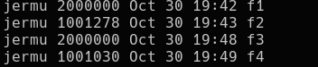

This is my solution to 5-3 from the Linux Programming Interface by Kerrisk.

The program demonstrates the difference between using lseek to get to the end of a file
and when using APPEND when opening a file. 

The exercise is to write a program that either uses lseek to reach the end of the file
and write a byte there, or simply to APPEND and write to the end of the file. 

calling the program twice in one call using:
'./atomic_append f1 1000000 & ./atomic_append f1 1000000'

creates a file f1 that is 1000000 bytes large.

calling the program with the file to use lseek instead of opening the file with the
APPEND flag using:

'./atomic_append f2 1000000 -x & ./atomic_append 1000000 f2 -x'

creates a file f2 that is significantly smaller in size. I suspect this is because
two processes are running at once, and when both try to reach the end of the file, 
they will inevitably just rewrite each other's last byte if they reach it.

I wrote the program to write both \0 characters and the "a" character. 

The sizes of the files are different, files f1 and f2 are both with the \0 character
and files f3 and f4 are with the "a" character. 

